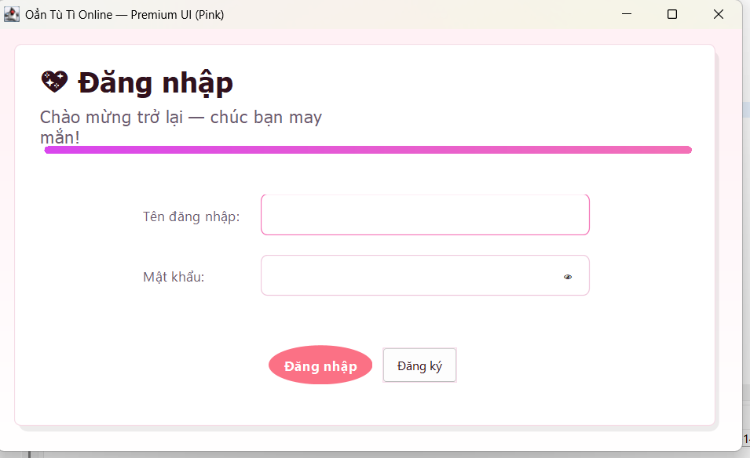
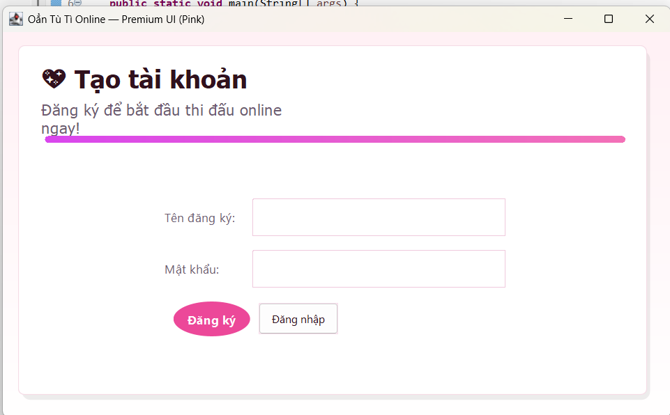
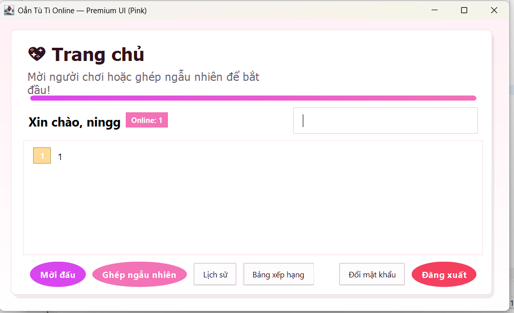
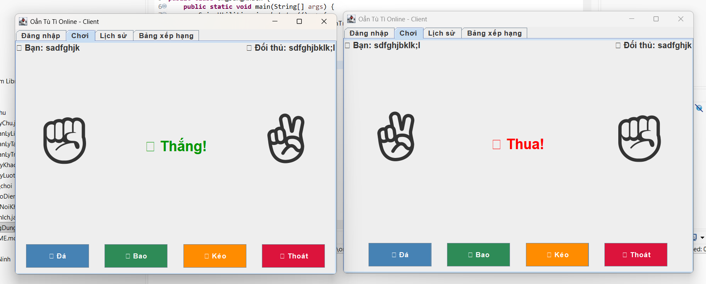
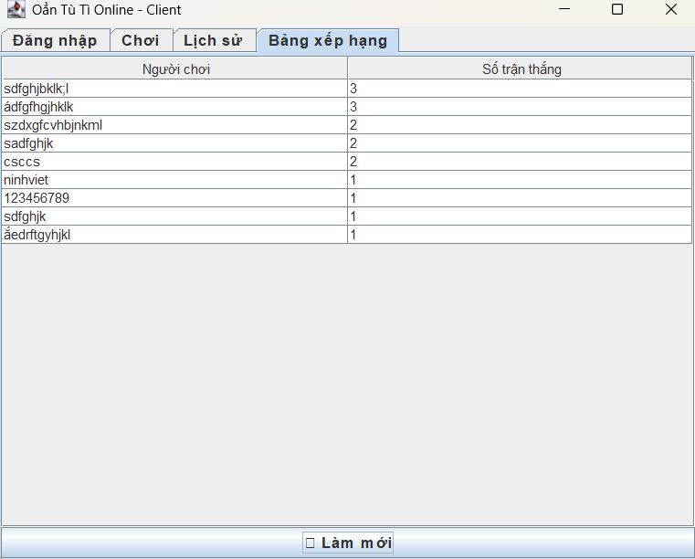
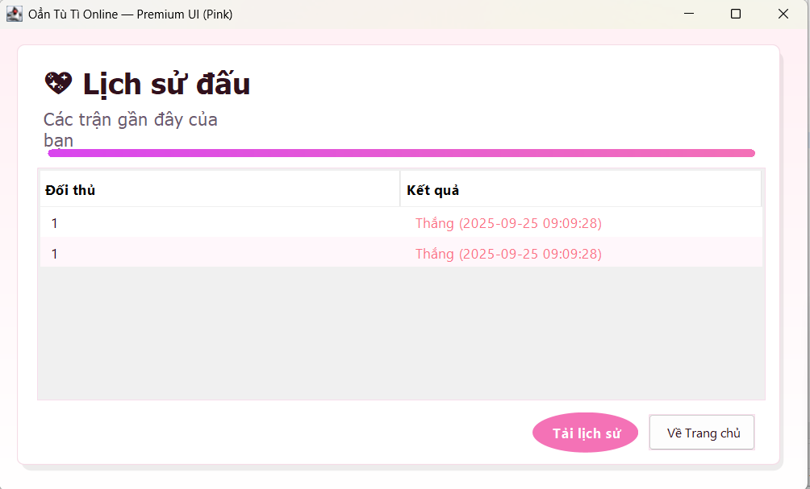

<h2 align="center">
  <a href="https://dainam.edu.vn/vi/khoa-cong-nghe-thong-tin">
  🎓 Faculty of Information Technology (DaiNam University)
  </a>
</h2>

<h2 align="center">
   GAME OẲN TÙ TÌ QUA MẠNG (TCP)
</h2>

<div align="center">
  <p align="center">
    
    
    
  </p>

  [](https://www.facebook.com/DNUAIoTLab)
  [](https://dainam.edu.vn/vi/khoa-cong-nghe-thong-tin)
  [](https://dainam.edu.vn)
</div>

---

## 📖 1. Giới thiệu hệ thống
Ứng dụng **Oẳn Tù Tì qua mạng (TCP Socket)** được phát triển nhằm mô phỏng trò chơi quen thuộc, cho phép người chơi thi đấu trực tuyến qua **LAN** hoặc **Internet**.

### 🔹 Hệ thống hỗ trợ:
- Đăng ký & Đăng nhập tài khoản  
- Tạo phòng chơi hoặc tham gia phòng ngẫu nhiên  
- Chọn ✊ Đá / ✋ Bao / ✌ Kéo và trả kết quả tức thì  
- Lưu lại **lịch sử thi đấu** và **bảng xếp hạng** người chơi  

### 🎯 Mục tiêu chính:
- Thực hành lập trình mạng với TCP Socket trong Java  
- Nắm vững kiến thức về kiến trúc Client–Server  
- Xây dựng ứng dụng game online cơ bản, nhiều người dùng  

---

## 🛠️ 2. Công nghệ sử dụng

[](https://www.java.com/)  
[](#)  
[](#)  
[](#)  

- **Ngôn ngữ:** Java  
- **Mạng:** TCP Socket (`ServerSocket`, `Socket`, `I/O Streams`)  
- **Giao diện:** Java Swing (FlatLaf theme)  
- **Quản lý dự án:** Maven / Gradle (tùy chọn)  
- **IDE:** Eclipse, IntelliJ IDEA, hoặc NetBeans  

---

## 🖼️ 3. Giao diện hệ thống

### 🔑 Đăng nhập
<p align="center">
  
</p>

---

### 📝 Đăng ký
<p align="center">
  
</p>

---

### 🏠 Trang chủ
<p align="center">
  
</p>

---

### 🎮 Chơi game
<p align="center">
  
</p>

---

### 🏆 Bảng xếp hạng
<p align="center">
  
</p>

---

### 📂 Lịch sử
<p align="center">
  
</p>

---

## ⚙️ 4. Cài đặt & Chạy

1. Cài đặt **JDK 17+ hoặc JDK 21**  
2. Cài đặt IDE (Eclipse / IntelliJ / NetBeans)  
3. Clone project:
   ```bash
   git clone https://github.com/nvninh2804nvn-boop/LTM-1604-D09-Game-TCP.git
   cd LTM-1604-D09-Game-TCP
Chạy chương trình:

Server: LTM/src/may_chu/AppServer.java

Client: LTM/src/nguoi_choi/UngDungClient.java (mở 2 client để test)

📬 5. Liên hệ

👤 Họ và tên: Nguyễn Việt Ninh
🎓 Khoa: Công nghệ thông tin – Trường Đại học Đại Nam
🌐 Website Khoa CNTT – DNU

📧 Email: nvninh2804@gmail.com

📱 Fanpage: AIoTLab – FIT DNU

<p align="center"> © 2025 AIoTLab, Faculty of Information Technology, DaiNam University. All rights reserved </p> ```
