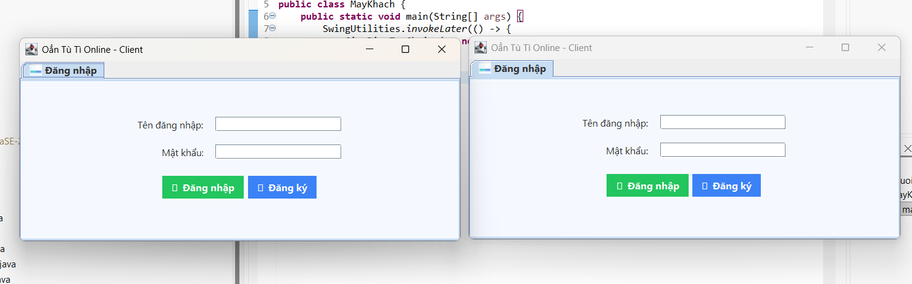
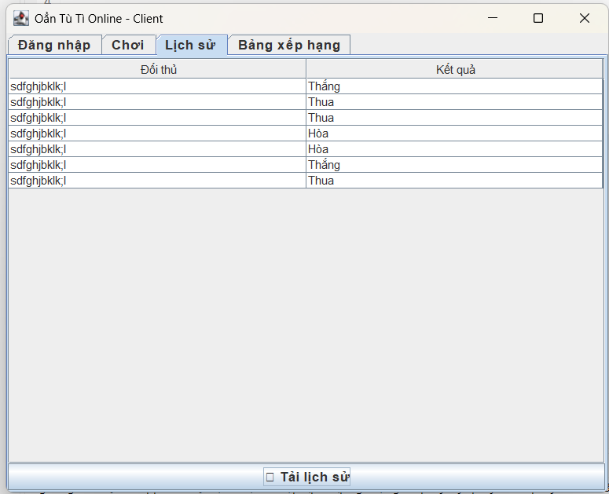

<h2 align="center">
    <a href="https://dainam.edu.vn/vi/khoa-cong-nghe-thong-tin">
    🎓 Faculty of Information Technology (DaiNam University)
    </a>
</h2>
<h2 align="center">
   GAME OẲN TÙ TÌ QUA MẠNG (TCP Socket)
</h2>
<div align="center">
    <p align="center">
        
        
        
    </p>

[](https://www.facebook.com/DNUAIoTLab)
[](https://dainam.edu.vn/vi/khoa-cong-nghe-thong-tin)
[](https://dainam.edu.vn)

</div>

## 📖 1. Giới thiệu hệ thống
Ứng dụng Oẳn Tù Tì qua mạng (TCP Socket) được xây dựng nhằm mô phỏng trò chơi quen thuộc, cho phép người chơi thi đấu trực tuyến qua LAN hoặc Internet.

### 🔹 Hệ thống hỗ trợ:
- Tạo phòng chơi hoặc tham gia phòng theo mã / ngẫu nhiên.  
- Thực hiện chọn ✊ Kéo / ✋ Bao / ✌ Búa và trả về kết quả tức thì.  
- Đảm bảo tính ổn định – uy tín – công bằng.  

### 🎯 Mục tiêu chính:
- Nắm vững kiến thức lập trình mạng với TCP Socket trong Java.  
- Thực hành xây dựng ứng dụng Client–Server nhiều người dùng.  
- Ứng dụng vào bài tập lớn, đồ án, hệ thống game online cơ bản.  

---

## 🛠️ 2. Công nghệ sử dụng [](https://www.java.com/)[](#)[](#)[](#)
- Ngôn ngữ lập trình: Java  
- Giao tiếp mạng: TCP Socket (`ServerSocket`, `Socket`, `I/O Streams`)  
- Mô hình kiến trúc: Client–Server  
- Giao diện người dùng:  
  - Java Swing (kết hợp FlatLaf để UI hiện đại)  
  - Có thể mở rộng bằng JavaFX  
- Quản lý dự án: Maven / Gradle (tuỳ chọn)  
- IDE khuyến nghị: IntelliJ IDEA, Eclipse, NetBeans  

---

## 🖼️ 3. Một số hình ảnh hệ thống

### 🔑 Đăng nhập


### 🎮 Chơi game


### 📂 Lịch sử


### 🏆 Bảng xếp hạng


---

> ## ⚙️ 4. Cài đặt
> 1. Cài đặt **JDK 17+ hoặc JDK 21**  
> 2. Cài **IDE** (Eclipse / IntelliJ / NetBeans)  
> 3. Clone project:
>    ```bash
>    git clone https://github.com/nvninh2804nvn-boop/LTM-1604-D09-Game-TCP.git
>    cd LTM-1604-D09-Game-TCP
>    ```
> 4. Chạy chương trình:
>    - **Server**: `LTM/src/may_chu/AppServer.java`  
>    - **Client**: `LTM/src/nguoi_choi/ClientApp.java` (mở 2 client để test)  

---

> ## 📂 Cấu trúc thư mục
> ```
> 📦 LTM
> ┣ 📂 bin
> ┣ 📂 db
> ┣ 📂 src
> ┃ ┣ 📂 assets
> ┃ ┃ ┣ aiotlab_logo.png
> ┃ ┃ ┣ dnu_logo.png
> ┃ ┃ ┣ fitdnu_logo.png
> ┃ ┃ ┣ login.png.png
> ┃ ┃ ┣ game.png.png
> ┃ ┃ ┣ history.png.png
> ┃ ┃ ┗ leaderboard.png.png
> ┃ ┣ 📂 may_chu
> ┃ ┗ 📂 nguoi_choi
> ┣ accounts.txt
> ┗ README.md
> ```

---

## 📬 5. Liên hệ  

> 👤 **Họ và tên**: NGUYỄN VIỆT NINH  
> 🎓 **Khoa**: Công nghệ Thông tin – Đại học Đại Nam  
> 🌐 [Website Khoa CNTT – DNU](https://dainam.edu.vn/vi/khoa-cong-nghe-thong-tin)  
> 📧 **Email**: nvninh2804@gmail.com  
> 📱 **Fanpage**: AIoTLab – FIT DNU  
>
> <p align="center">
> © 2025 AIoTLab, Faculty of Information Technology, DaiNam University. All rights reserved  


> </p>

